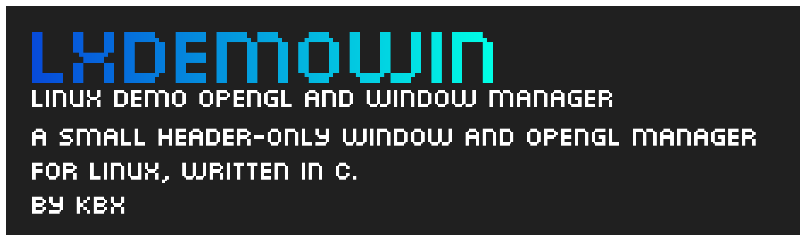

 

# LxDemOWin
### **Linux Demo OpenGL** *and* **Window** *manager*

A small header-Only Window and OpenGL manager made in C, written in about 2 hours. With some basic code (plain window with OpenGL loaded) and compression, it compiles to ~4.1kb. Good for demoscene use.

It also comes with some nifty features, like timers and shader managment for OpenGL.

(licensed under the MIT license)

# Dependencies

- XOrg (-lX11)
- OpenGL (-lGl)

# Q&A

### Why is X so unpolished?
lazy

### Why is X so unoptimised?
lazy, and if you know how, make a PR

### Why does the readme use html?
lazy + i want things centered

### Why are you so lazy?
i made this in 2 hours and i dont plan examining 2 lines for 10 hours to make one improvment. this was made so that i could quickly hop onto making another project. I will occasionally update this with new features here and there.

### Why cant you use -nostartlibs, ect?
it compiles but when i run it i get segfaults. i literally have no idea why this happens, and a workaround would be much appreciated (would compile to **3.4kb!**)

### Why another window manager? We already have GLFW/SDL ect.
not small enough (see [SmallGlitter's](https://github.com/PipeWarp/Small-Glitter) size for reference)

